# Library Reactive Stack – Dual OAuth2 Resource Servers Example
This project demonstrates a reactive, token-secured library system built with Spring WebFlux and Spring Security (Reactive).
Both services act as OAuth2 Resource Servers, performing JWT validation against a common Authorization Server (Keycloak).
An external Angular SPA (library-client-spa) authenticates users and calls the library-frontend REST API, which in turn calls library-backend.

## Project Structure (MonoRepo)
| Module                   | Description                                                            |
| ------------------------ | ---------------------------------------------------------------------- |
| **library-commons**      | Shared domain classes, DTOs, and utilities                             |
| **library-frontend**     | Reactive API gateway / resource server, called by `library-client-spa` |
| **library-backend**      | Reactive backend service, also an OAuth2 resource server               |
| **library-client-spa**   | Angular SPA performing user login and calling the `library-frontend`   |
| **Authorization Server** | Keycloak – issues tokens and provides the JWKS endpoint                |

## Components Overview
| Layer                               | Component                           | Purpose                                                                                                 |
| ----------------------------------- | ----------------------------------- | ------------------------------------------------------------------------------------------------------- |
| **Frontend (`library-frontend`)**   | Spring Boot WebFlux Resource Server | Validates JWTs from the Angular SPA and forwards requests to the backend using `WebClient`              |
|                                     | Reactive REST Controllers           | Exposes public JSON APIs (e.g. `/api/books`, `/api/users`)                                              |
|                                     | WebClient (Reactive)                | Calls `library-backend` with the original Bearer Token                                                  |
| **Backend (`library-backend`)**     | Spring Boot WebFlux Resource Server | Validates JWTs reactively via the JWKS endpoint from Keycloak                                           |
|                                     | Reactive REST APIs                  | Provides data and business logic (e.g. `/api/books`, `/api/authors`)                                    |
| **Authorization Server (Keycloak)** | `/token`, `/.well-known/jwks.json`  | Issues JWT access tokens, exposes JWKS for signature verification                                       |
| **Client (`library-client-spa`)**   | Angular (OIDC Client)               | Handles login via Authorization Code Flow (PKCE), stores tokens in browser, and calls the resource APIs |

## Core Spring Components per Module
| Module               | Area                    | Key Classes / Beans                                                                          | Purpose                                              |
| -------------------- | ----------------------- | -------------------------------------------------------------------------------------------- | ---------------------------------------------------- |
| **library-frontend** | **Security (Reactive)** | `SecurityWebFilterChain` with `.oauth2ResourceServer().jwt()`, `ReactiveJwtDecoder` (Nimbus) | Validates JWTs sent from the Angular SPA             |
|                      | **Web / REST API**      | `@RestController`, returning `Mono<ResponseEntity<?>>` with JSON only                        | Handles REST endpoints and forwards calls to backend |
|                      | **Service / WebClient** | `WebClient` configured with `ExchangeFilterFunction` for bearer propagation                  | Forwards requests and tokens to `library-backend`    |
|                      | **Configuration**       | `spring.security.oauth2.resourceserver.jwt.jwk-set-uri` in `application.yml`                 | Configures JWKS endpoint for token validation        |
| **library-backend**  | **Security (Reactive)** | Same as `library-frontend`: `SecurityWebFilterChain` + `ReactiveJwtDecoder`                  | Validates tokens reactively                          |
|                      | **Web / REST API**      | `@RestController`, JSON only                                                                 | Exposes protected REST endpoints                     |
|                      | **Data Layer**          | `ReactiveCrudRepository`, `@Service`                                                         | Reactive persistence via R2DBC                       |

## Flow

```mermaid
flowchart TB
    subgraph SPA["🧭 library-client-spa (Angular + OIDC Client + PKCE)"]
        C1["Login with Keycloak"]
        C2["Store Access Token (JWT)"]
        C3["Call /api/books on library-frontend with Bearer Token"]
    end

    subgraph FRONTEND["💻 library-frontend (Reactive OAuth2 Resource Server)"]
        F1["SecurityWebFilterChain + oauth2ResourceServer().jwt()"]
        F2["Validate JWT"]
        F3["Forward request via WebClient -> library-backend (Bearer Token)"]
        F4["Return JSON Response"]
    end

    subgraph BACKEND["⚙️ library-backend (Reactive OAuth2 Resource Server)"]
        B1["Validate JWT via JWKS"]
        B2["Reactive Business Logic / DB Access"]
        B3["Return JSON Data"]
    end

    subgraph AUTH["🛡️ Authorization Server (Keycloak)"]
        A1["/token (issues JWT)"]
        A2["/.well-known/jwks.json (JWKS keys)"]
    end

    C1 -->|"Authorization Code Flow + PKCE"| AUTH
    C2 -->|"Access Token (JWT)"| FRONTEND
    FRONTEND -->|"Forward Bearer Token"| BACKEND
    BACKEND -->|"Validate JWT"| AUTH
    BACKEND -->|"JSON Response"| FRONTEND
    FRONTEND -->|"JSON Response"| SPA

```

## Architecture

